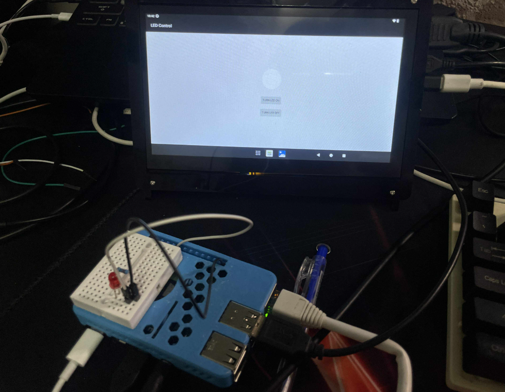

This is a project to control turning an LED on and off on a Raspberry Pi 4 using Android 13. The project is developed from the kernel level up to the application layer.

Hardware setup: Connect the positive lead of the LED to GPIO pin 23 on the Raspberry Pi 4. You can use a dedicated display or utilize scrcpy for screen access.

Link youtube: https://youtu.be/7LA-lIDnix8
